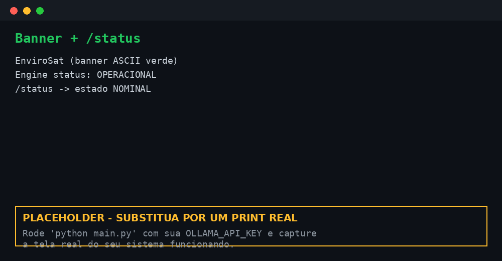
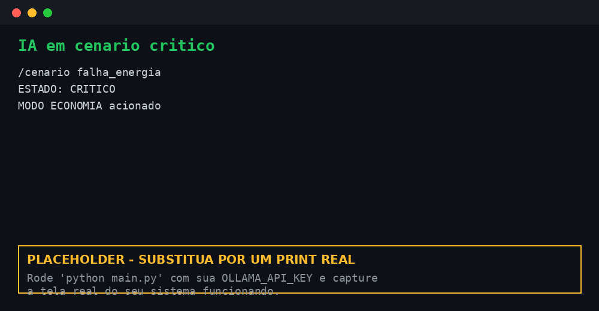

# 🚀 Mission Control AI — EnviroSat

Sistema de monitoramento operacional de um satélite de **observação ambiental**
(trilha **EnviroSat**) que lê telemetria simulada, detecta anomalias com lógica
Python e usa IA generativa (Ollama Cloud · `gpt-oss:120b`) para traduzir o estado
da missão em linguagem natural — sempre conectando cada leitura técnica ao seu
**impacto ambiental na Terra** (desmatamento, incêndios, áreas protegidas).

## 👥 Integrantes

- Lincoln Simão Pereira — RM: 567284 — Turma: 1CCPS
- Miguel Silva Bezerra — RM: 566763 — Turma: 1CCPS
- Nicolas Sakaue Nishimura — RM: 567752 — Turma: 1CCPS

> Modalidade: **Trio** · Disciplina: Prompt Engineering and Artificial Intelligence
> · Prof. Jorge Luiz Gomes · FIAP · Global Solution 2026.1

## 🛰 O que o projeto faz

O EnviroSat simula um satélite ambiental (estilo Amazônia-1 / Landsat). A cada
ciclo, o módulo `telemetria.py` gera um instantâneo plausível de seis parâmetros
(temperatura do payload, energia, buffer de imagens, precisão de geolocalização,
qualidade do downlink e focos de calor detectados). O módulo `alertas.py`
classifica a severidade em **Python** (thresholds determinísticos) e dispara
respostas automatizadas em situações críticas. O `engine.py` injeta esses dados
no prompt e chama o `gpt-oss:120b` via Ollama Cloud para gerar um diagnóstico que
amarra o estado técnico ao que isso significa para o combate a incêndios e ao
monitoramento ambiental no Brasil.

## 🎭 Persona atendida

O sistema atende três personas e adapta o tom: o **operador do centro de controle
ambiental** (INPE / órgão estadual), o **coordenador de brigada de combate a
incêndio** e o **analista de compliance ambiental**. A persona-foco da
demonstração é o operador, porque é quem toma decisão imediata diante de um alerta
e decide quando acionar a brigada.

## 🧰 Tecnologias utilizadas

- Python 3.10+
- Ollama Cloud API (modelo `gpt-oss:120b`)
- Bibliotecas: `ollama`, `python-dotenv`, `rich`, `prompt-toolkit`, `pyfiglet`

## ▶️ Como executar

1. Clone o repositório:
   ```bash
   git clone https://github.com/lincoln743/GS_Prompteia.git
   cd GS_Prompteia
   ```
2. Crie e ative um ambiente virtual:
   ```bash
   python -m venv .venv && source .venv/bin/activate   # Linux/macOS
   # .venv\Scripts\activate                            # Windows
   ```
3. Instale as dependências:
   ```bash
   pip install -r requirements.txt
   ```
4. Crie o arquivo `.env` na raiz (copie de `.env.example`) com a sua chave:
   ```
   OLLAMA_API_KEY=sua_chave_aqui
   ```
5. Execute:
   ```bash
   python main.py
   ```

### Comandos da CLI

| Comando | O que faz |
|---|---|
| `/status` | Instantâneo da telemetria (sem IA) |
| `/cenario <nome>` | Força um cenário no próximo ciclo |
| `/help` | Lista os comandos |
| `/about` | Sobre o projeto |
| `/clear` | Limpa a tela |
| `/exit` | Encerra |
| *(qualquer frase)* | Envia à IA para análise da missão |

Cenários disponíveis: `normal`, `incendio_intenso`, `falha_energia`,
`superaquecimento`, `perda_downlink`, `extremo`.

## 🖼 Demonstração




## 🧠 System Prompt

O system prompt completo está em [`prompts/system_prompt.md`](prompts/system_prompt.md).
Ele define papel (copiloto de operações do EnviroSat), escopo (apenas a missão),
restrições (não inventar dados, respeitar a severidade já calculada em Python),
formato de saída fixo (Estado → Diagnóstico → Impacto na Terra → Recomendação) e
inclui **few-shot prompting** com dois exemplos (operação nominal e energia
crítica).

## 🧪 Cenários de teste demonstrados

1. **Operação normal** — todos os parâmetros na faixa nominal, estado NOMINAL.
2. **Incêndio intenso** — 142 focos detectados, buffer enchendo: ATENÇÃO + foco no
   despacho de brigadas.
3. **Energia crítica** — bateria a 14%, dispara `MODO ECONOMIA` automaticamente.
4. **Superaquecimento** — payload a 78 °C, dispara `PROTEÇÃO TÉRMICA`.
5. **Perda de downlink** — enlace degradado e buffer saturado, dispara
   `RETENÇÃO SEGURA` / `PRIORIZAÇÃO DE DOWNLINK`.

## 🔁 Iterações do prompt (processo)

- **v1** — genérico ("analise os dados do satélite"): o modelo descrevia números,
  mas ignorava o impacto terrestre.
- **v2** — adicionamos a "regra de ouro" (amarrar à Terra) e o formato fixo de
  saída: melhorou muito, mas o modelo às vezes recalculava se era crítico,
  contradizendo o Python.
- **v3** — instruímos explicitamente a **respeitar a severidade já classificada**
  e adicionamos os dois exemplos few-shot. A saída ficou estável e consistente
  entre execuções (temperatura 0.3).

## 💼 Proposta de valor / modelo de negócio

**1. Qual o problema real terrestre que esta missão resolve?**
O Brasil perde florestas e biomas inteiros porque focos de calor são detectados e
geolocalizados tarde demais para o despacho de brigadas. O EnviroSat encurta a
distância entre o dado orbital e a decisão em terra: ele detecta o foco, mede a
confiabilidade da coordenada e traduz tudo para uma recomendação acionável,
reduzindo o tempo entre "começou a queimar" e "a brigada está a caminho".

**2. Quem paga pela solução?**
Modelo **híbrido**. O núcleo é setor público — INPE/órgãos ambientais estaduais e
o IBAMA financiam a operação como infraestrutura de fiscalização (analogamente a
DETER/PRODES). Uma camada privada de dado-como-serviço atende seguradoras de
ativos florestais, certificadoras de crédito de carbono e empresas com
compromissos de compliance ambiental que precisam comprovar monitoramento.

**3. Métrica de impacto (1 ano de satélite 100% saudável)**
Cobertura de monitoramento de aproximadamente **2,5 milhões de hectares de áreas
protegidas e de risco**, com redução estimada de **15 a 25% no tempo médio de
resposta a focos** detectados — o que, em temporada de seca, pode significar
centenas de incêndios contidos ainda em estágio inicial e milhares de toneladas
de CO₂ evitadas em emissões de queimadas.

**4. Modelo de negócio**
**Dado-como-serviço (DaaS) com concessão pública na base.** O governo banca a
operação contínua do satélite (concessão/contrato de serviço público de
monitoramento); o acesso a relatórios, séries históricas e alertas customizados é
oferecido por assinatura a clientes privados (seguros, carbono, agronegócio
adjacente).

## ⚠️ Limitações conhecidas

- A telemetria é **simulada** (random walk + cenários), não vem de um satélite real.
- A geração de focos de calor não usa imagens reais nem modelo físico — é uma
  contagem plausível para fins de demonstração.
- A IA é não-determinística; mesmo com temperatura baixa (0.3), a redação varia
  entre execuções, ainda que o diagnóstico se mantenha consistente.
- Não há persistência em banco de dados; a memória de contexto guarda apenas os
  últimos 5 ciclos em memória RAM e é perdida ao encerrar a sessão.

## 🎬 Vídeo de demonstração

🔗 [Assistir demonstração no YouTube](https://www.youtube.com/watch?v=SEU_ID_AQUI)

> Configurado como "Não listado" no YouTube.
